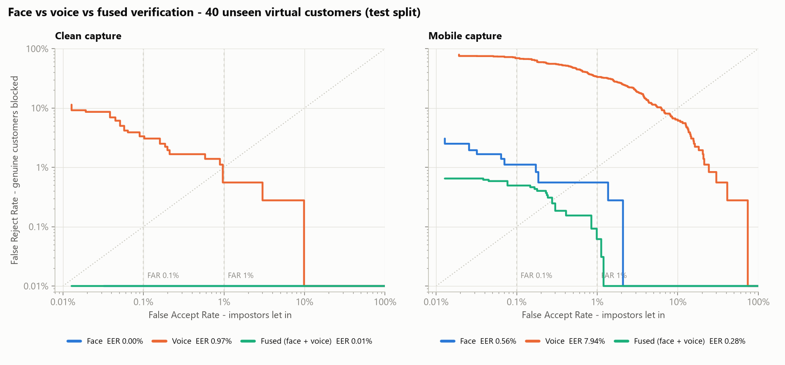
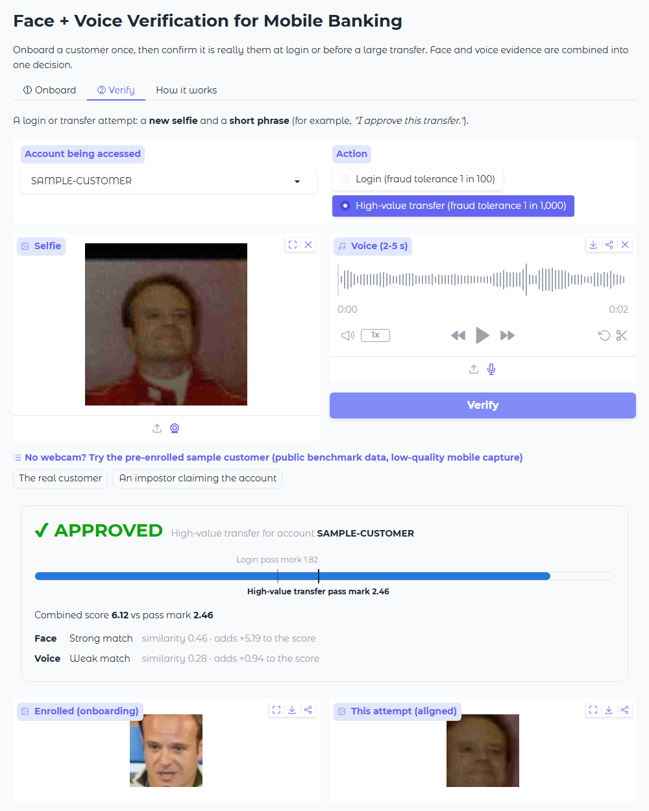
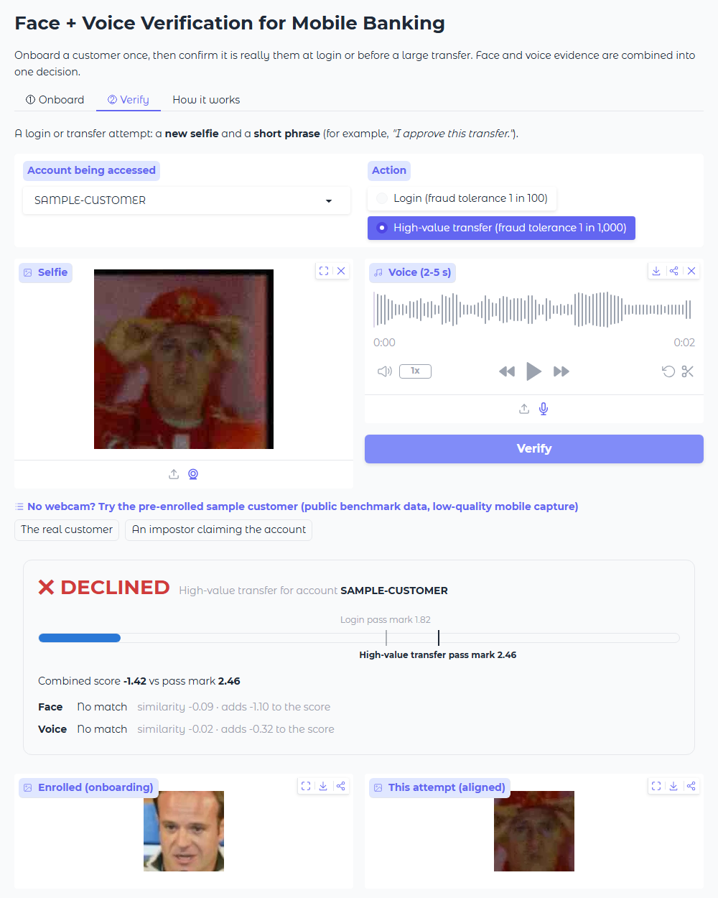

# Multimodal Biometric Verification for Mobile Banking KYC

**Is the person on the phone really the customer who opened this account?**

This project builds and evaluates a face + voice biometric verification system for a
mobile-first bank. It covers the three moments where a bank needs to confirm identity
without a branch visit:

| Moment | What happens | Security level used here |
|---|---|---|
| **Remote onboarding (e-KYC)** | Customer (or an agent on their behalf) captures a selfie and a short voice sample. These become the enrolled *template*. | - |
| **App login / step-up** | Customer takes a quick selfie and speaks a phrase. | FAR ≤ 1% |
| **High-value transfer approval** | Same capture, stricter threshold. | FAR ≤ 0.1% |

This is **1:1 verification**, not recognition. The system never searches "who is this?"
across all customers. It answers a yes/no question: "does this capture match the
template enrolled for *this* account?"

---

## Headline result



*How to read this chart:* x = how many impostors get in (fraud risk), y = how many
genuine customers get blocked (friction). Both axes are log-scale, and **lower-left is
better**. The dashed verticals mark the two security levels a bank would run at. The
dotted diagonal is where both error rates are equal (the EER). A curve on the bottom
edge means zero errors.

**Under realistic mobile capture conditions, combining face and voice roughly halves the
errors of face alone: EER falls from 0.56% to 0.28%, and genuine customers blocked at a
0.1% fraud tolerance fall from 1.11% to 0.49%.**

Results on 40 held-out virtual customers (3,240 genuine attempts, 15,600 impostor
attempts), with fusion tuned only on 40 different customers:

| Mobile capture (login selfie + spoken phrase) | EER [95% CI] | Customers blocked @ FAR 1% | Customers blocked @ FAR 0.1% [95% CI] |
|---|---:|---:|---:|
| Face only (ArcFace) | 0.56% [0.05–1.21] | 0.56% | 1.11% [0.00–2.51] |
| Voice only (ECAPA-TDNN) | 7.94% [6.11–9.44] | 33.3% | 69.2% [58.1–78.9] |
| **Fused (face + voice)** | **0.28%** [0.01–0.43] | **0.06%** | **0.49%** [0.00–1.20] |

**Is the improvement real or luck?** The 95% intervals come from 1,000 bootstrap
resamples of the *customers* (not individual attempts, which are correlated within an
account). Fusion beats face alone in **99% of resamples on EER and 93% on FRR**. That
it helps is well supported. *How much* it helps is not pinned down with 40 test
customers: an earlier run with different random degradation draws showed a 4.5x
reduction instead of about 2x. Read "roughly halves" as the honest summary.

- Fusion beats the **best** single modality, even though voice alone is weak in these
  conditions. The two modalities fail on *different* attempts, so each covers the
  other's bad captures. At the 0.1% FAR threshold, face alone blocked 18 genuine
  attempts; fusion let 10 of them through.
- Under **clean** capture, face alone is already perfect on this test set (0 errors),
  so fusion has nothing to add there. The value of a second modality appears exactly
  when capture quality drops, which is the everyday reality of low-end phones, poor
  lighting and noisy streets.

---

## What each part does

```
             ┌──────────── onboarding (clean) ────────────┐
selfie  ──►  detect ─► align (5 landmarks) ─► ArcFace ─► 512-d face template ──┐
voice   ──►  16 kHz mono ─────────────────► ECAPA-TDNN ─► 192-d voice template ─┤  stored per customer
                                                                                │  (embeddings only,
             ┌──────────── login / transfer (mobile) ─────┐                     │   never raw media)
selfie  ──►  same face pipeline ─► cosine similarity vs. face template ──► z-norm ─┐
voice   ──►  same voice pipeline ─► cosine similarity vs. voice template ─► z-norm ─┴─► weighted sum ─► threshold
                                                                                                 (per risk tier)
                                                                                                   ► APPROVE / DECLINE
```

### 1. Face verification: [`face_verification/`](face_verification/)
- **Model:** InsightFace `buffalo_l`: a RetinaFace-style detector with 5 facial
  landmarks, similarity-transform alignment to the canonical 112×112 template, and an
  **ArcFace ResNet-50** embedding. It is pretrained and used as-is, with no training
  from scratch.
- **Data:** LFW (Labeled Faces in the Wild), with the official 6,000-pair, 10-fold
  protocol.
- **If several faces are in frame** (e.g. bystanders), the one closest to the centre is
  used.
- **Sanity check against the literature:** 99.83% standard LFW 10-fold accuracy, in
  line with published ArcFace results.

| LFW, 6,000 pairs | EER | AUC | FRR @ FAR 1% | FRR @ FAR 0.1% |
|---|---:|---:|---:|---:|
| Clean | 0.27% | 0.9994 | 0.20% | 0.27% |
| Mobile-degraded probe | 0.70% | 0.9983 | 0.67% | 1.00% |

### 2. Voice verification: [`voice_verification/`](voice_verification/)
- **Model:** SpeechBrain **ECAPA-TDNN** (`spkrec-ecapa-voxceleb`), producing 192-d
  speaker embeddings. It was trained on VoxCeleb and is used here with no fine-tuning.
- **Data:** LibriSpeech test-clean + dev-clean: 80 speakers, 5,323 utterances.
  LibriSpeech has no official verification list, so a fixed, seeded one of 16,000
  trials is generated, and it is deliberately hard:
  - genuine pairs come from **different recording sessions** (enrolled weeks ago,
    verifying today)
  - impostors are **same-gender** (a fraudster would not pick a victim of a different
    gender)
- **Cross-domain:** the model has never seen these speakers or this recording style.

| LibriSpeech, 16,000 trials | EER | AUC | FRR @ FAR 1% | FRR @ FAR 0.1% |
|---|---:|---:|---:|---:|
| Clean | 2.26% | 0.9961 | 3.27% | 7.21% |
| Mobile-degraded probe | 10.89% | 0.9599 | 36.8% | 61.8% |

### 3. Fusion: [`fusion/`](fusion/)
- **Virtual customers.** No public dataset has both face and voice for the same large
  group of people. Following standard practice in multimodal biometrics research, each
  of **80 virtual customers** is one LFW identity paired with one LibriSpeech speaker.
  Each customer gets 1 enrollment sample plus 9 probe samples per modality.
- **No leakage.** Customers are split 40 / 40. Score normalisation, the fusion weight
  and all thresholds are fitted on the *dev* customers only, and every number above
  comes from the *test* customers.
- **Method.** Simple, auditable **weighted score-level fusion**:
  1. each score is normalised against its own impostor distribution:
     `z = (score − μ_impostor) / σ_impostor`, i.e. "how far above a typical impostor?"
  2. fused = `w · z_face + (1 − w) · z_voice`, with `w` grid-searched on dev
     (`w = 0.65` for mobile capture)
  3. equal weights (`w = 0.5`) do just as well on the test customers (EER 0.25%), so
     the gain comes from combining two independent signals, not from tuning.
- **Failed capture** (no face found, or under 0.5 s of audio): that modality contributes
  "no evidence" (score 0). The other modality can still carry the decision.
- **Extension:** learned fusion (logistic regression or a small MLP on the two scores,
  or quality-aware weights that trust face less in the dark and voice less in noise) is
  the natural next step. Simple fusion is enough to show the benefit here.

### 4. The KYC service interface: [`fusion/kyc_verifier.py`](fusion/kyc_verifier.py)

```python
kyc = KYCBiometricVerifier(condition="mobile")
kyc.enroll("CUST-0048", selfie, voice)                          # onboarding
d = kyc.verify("CUST-0048", selfie, voice, risk_tier="high_value_transfer")
d.accepted, d.face_score, d.voice_score, d.fused_score, d.threshold, d.reason
```

`python scripts/demo.py` onboards two customers and runs three scenarios:

```
Genuine customer logs in                        fused=5.60 vs threshold 1.82 -> APPROVED
Genuine customer approves a large transfer      fused=5.60 vs threshold 2.46 -> APPROVED
Impostor tries a large transfer on the account  fused=-0.63 vs threshold 2.46 -> DECLINED
```

### 5. Interactive web demo: [`app.py`](app.py)

```bash
python app.py      # open http://127.0.0.1:7860
```

- **Onboard:** take a selfie with the webcam and record about 5 s of speech.
- **Verify:** take a new selfie, say a short phrase, and choose *Login* or
  *High-value transfer*. The app shows the decision, each modality's contribution, both
  pass marks, and the aligned face crop the model actually compared.
- **No webcam?** A sample customer is pre-enrolled, with two one-click attempts: the
  real customer and an impostor. Both use low-quality mobile captures from the test
  split.

| The real customer: approved. A strong face match carries a noisy 2 s voice clip | An impostor claiming the account: declined |
|---|---|
|  |  |

Enrolled templates live only in the browser session's memory. The demo has **no
liveness detection** (see below), and its pass marks were calibrated on benchmark data,
so a live webcam and microphone may score differently.

---

## The "mobile capture" condition

On clean benchmark data both pretrained models are close to perfect, which says little
about the field. So every evaluation also runs a **mobile** condition. Enrollment stays
high-quality (assisted onboarding); the *login* capture is degraded:

| Modality | Degradation applied to the login probe | Real-world cause |
|---|---|---|
| Face | 1/4 resolution, exposure ×0.55 plus sensor noise, JPEG quality 20 | cheap front camera, dim room, upload over a weak connection |
| Voice | 2-second clip, 8 kHz narrowband, white noise at 5 dB SNR | quick passphrase, telephony/low-bitrate codec, market or traffic noise |

The parameters were fixed once, before running fusion. They were not tuned to make
fusion look good. The randomness (which 2-second segment, which noise) is seeded by
file name, so results are reproducible on any machine.

---

## What a bank would learn from this

1. **Pick thresholds by risk tier, not by EER.** The system runs at FAR 1% for login and
   FAR 0.1% for transfers. The cost of the stricter tier is paid in friction: FRR
   rises from 0.06% to 0.49% for fused, and from 0.56% to 1.11% for face alone.
2. **Thresholds drift on new customers.** When the 0.1%-FAR threshold is fixed on the
   dev customers and applied to unseen test customers, the observed FAR is 0.21–0.29%
   (face / fused), and 0.56% for face under clean capture. With only 40 calibration
   customers, the impostor-score tail is under-sampled. A production system must
   calibrate on thousands of *local* customers, keep a safety margin, and monitor FAR
   and FRR in production.
3. **A second modality matters most when the first one struggles.** Fusion is
   insurance for the bad-capture days, not a benchmark trick.

---

## Security considerations (spoofing & liveness)

Verification answers "does this match the template?", **not** "is a live person
presenting it?". A production KYC system needs presentation-attack detection (PAD) on
top. It is out of scope to build here, but these are the risks it would have to cover:

| Modality | Attack | Mitigation a production system needs |
|---|---|---|
| Face | Printed photo, or a photo/video replayed on a screen | Passive liveness / PAD model (texture, moiré, depth cues) and active challenges (blink, head turn). Certify against ISO/IEC 30107-3. |
| Face | 3D mask | Depth/IR sensing where available, or PAD models trained on mask attacks |
| Face | **Injection attack**: a deepfake video fed through a virtual camera, bypassing the lens | Injection-attack detection, app attestation / rooted-device checks, signed capture from the camera SDK |
| Voice | Replay of a recorded sample | **Random challenge phrases** (e.g. read 6 random digits), so a stored recording can't answer; replay-detection countermeasures |
| Voice | **Voice cloning / TTS** (a growing threat) | Synthetic-speech detection (ASVspoof-style countermeasures such as AASIST). Never allow voice alone to approve high-value actions. |
| Both | Stolen templates | Store embeddings only, encrypted at rest; template-protection schemes; never keep raw selfies or audio longer than regulation requires |

Fusion raises the cost of an attack, because the attacker must defeat *both*
modalities. It is **not** a substitute for liveness. With a weighted sum, a very
convincing face deepfake could still carry the fused score, which is why each modality
needs its own PAD gate before fusion.

**Fairness and local validity.** LFW is dominated by Western public figures, and the
voice model was trained mostly on English speech. Before deploying for Cambodian
customers, error rates must be measured on a locally representative population:
Southeast Asian faces, Khmer speech, local phone models. Thresholds should be checked
per demographic group, since face recognition error rates are known to vary across
groups (NIST FRVT).

---

## Limitations (stated plainly)

- **Virtual customers.** Face and voice come from different people, which assumes the
  two scores are independent. That is reasonable for these modalities, but it is
  not the same as real paired data.
- **Small test population.** 40 test customers yield plenty of trials (18,840) but few
  distinct *identities*. Very low error rates therefore carry wide uncertainty, which
  is why the headline table shows customer-level bootstrap CIs.
- **Synthetic degradation.** It stands in for real mobile captures and is not a
  measurement of them.
- **Read speech, English only.** LibriSpeech is read audiobook speech. A Khmer
  passphrase over a real phone line would behave differently.

---

## Run it

```bash
python -m venv .venv && .venv\Scripts\activate        # (Linux/macOS: source .venv/bin/activate)
pip install torch torchaudio --index-url https://download.pytorch.org/whl/cu130   # or /whl/cpu
pip install -r requirements.txt
python run_all.py        # download data -> face -> voice -> fusion -> demo
```

Or run each step on its own:

```bash
python scripts/download_data.py          # LFW (~180 MB) + LibriSpeech test/dev-clean (~700 MB)
python -m face_verification.evaluate     # -> results/face_metrics.json, face_roc.png
python -m voice_verification.evaluate    # -> results/voice_metrics.json, voice_roc.png
python -m fusion.evaluate                # -> results/fusion_metrics.json, fusion_roc.png, fusion_config.json
python scripts/demo.py                   # end-to-end KYC scenarios (command line)
python app.py                            # interactive web demo
```

The first run embeds about 8,000 face images and 5,300 utterances, each once per
capture condition. A GPU is recommended; on CPU, face embedding alone took about an
hour on a laptop. Embeddings are cached in `cache/`, so re-runs take seconds.

```
common/               metrics (FAR/FRR/EER/ROC), plots, embedding cache
face_verification/    InsightFace embedder, LFW protocol, evaluation
voice_verification/   ECAPA embedder, LibriSpeech protocol, evaluation
fusion/               virtual customers, score fusion, comparative evaluation, KYC service API
scripts/              data download, end-to-end demo, demo example generator
app.py                Gradio web demo (onboard + verify)
demo_examples/        sample customer files bundled with the web demo
results/              metrics JSON + plots (face_roc.png, voice_roc.png, fusion_roc.png)
```

**Data:** public benchmark datasets only (LFW, LibriSpeech). No real customer data is
used.
